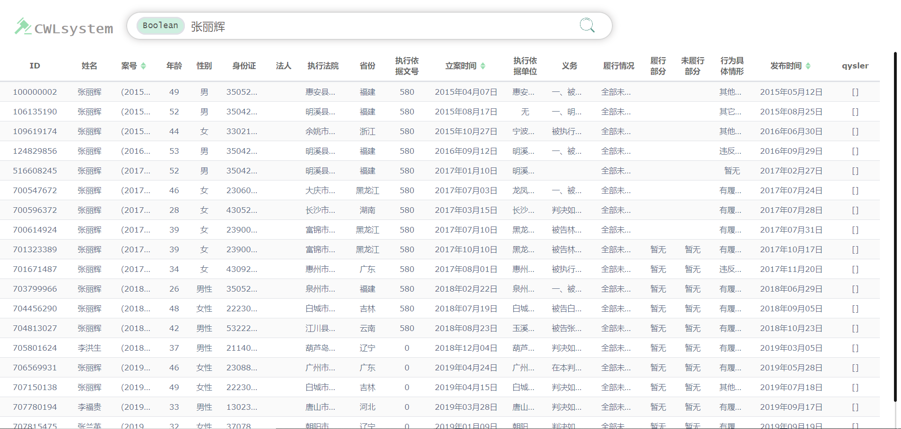

## 目录结构
```
│  readme.md
│  
├─ client
│  │  index.html
│  │  resultDisplay.html
|  |
│  ├─css
│  ├─data
│  ├─font
│  ├─fonts    
│  ├─image
│  ├─js
│  │      Boolean_search.js
│  │      Tolerant_search.js
│  │      Query_search.js
|  |      Init.js
│  │      observer.js
│  │     
│  └─jslib
|
└─server
    │  data_process.py
    │  server.py
    |
    ├─.idea
    ├─venv
    └─__pycache__
```            


## 数据库中的表
- ### ```instruments: 3089 records```

|  Index    |  Attribute     |  Type         |   Detail   |
|  :---:    |  :-------:     |  ---:         |   :---     |
|1          | ID             |     CHAR(100) | id of this piece of data |
|2          | caseCode       |     TEXT      | 案号|
|3          | Title          |     TEXT      | 标题|
|4          | Type           |     TEXT      | 文书类别|
|5          | Cause          |     TEXT      | 案由|
|6          | Department     |     TEXT      | 承办部门|
|7          | Level          |     TEXT      | 级别|
|8          | ClosingDate    |     DATE      | 结案日期|
|9          | Content        |     TEXT      | the complete legal instrument|

- ### ```data1: 1246571 records```

|  Index    |  Attribute     |  Type         |   Detail   |
|  :---:    |  :-------:     |  ---:         |   :---     |
|1          | ID             |     INT       | id of this piece of data |
|2          | iname          |     TEXT      | 被执行人姓名/名称|
|3          | caseCode       |     TEXT      | 案号|
|4          | age            |     INT       | 年龄|
|5          | sexy           |     CHAR(10)  | 性别|
|6          | cardNum        |     TEXT      | 身份证号码/组织机构代码|
|7          | businessEntity |     TEXT      | 法人 (若被执行人为公司)|
|8          | courtName      |     TEXT      | 执行法院|
|9          | areaName       |     TEXT      | 省份|
|10         | partyTypeName  |     TEXT      | Just ignore this key...|
|11         | gistId         |     TEXT      | 执行依据文号|
|12         | regDate        |     DATE      | 立案时间|
|13         | gistUnit       |     TEXT      | 做出执行依据单位|
|14         | duty           |     TEXT      | 生效法律文书确定的义务|
|15         | performance    |     TEXT      | 被执行人履行情况|
|16         | performedPart  |     TEXT      | 履行部分|
|17         | unperformPart  |     TEXT      | 未履行部分|
|18         | disruptTypeName|     TEXT      | 被执行人行为具体情形|
|19         | publishDate    |     DATE      | 发布时间|
|20         | qysler         |     TEXT      | [{'cardNum': 人员身份证号码, 'corporationtypename':人员与公司关系, 'iname': 人员姓名}] (若被执行人为公司)|

- ### ```data2: 390355 records```

|  Index    |  Attribute     |  Type         |   Detail   |
|  :---:    |  :-------:     |  ---:         |   :---     |
|1          | caseCode       |     TEXT      | 案号 |
|2          | iname          |     CHAR(20)  | 被执行人|
|3          | iaddress       |     TEXT      | 被执行人地址|
|4          | imoney         |     TEXT      | 被执行标的金额（元）|
|5          | ename          |     CHAR(20)  | 申请执行人|
|6          | courtName_phone|     TEXT      | 承办法院|

## 使用步骤
1. 安装tornado
```
    pip install -r requirements.txt
```
2. 启动服务器
```
    python server.py
```
3. chrome中打开127.0.0.1:8661看到如下页面

4. 输入查询之后跳转到结果页面（未完成）
